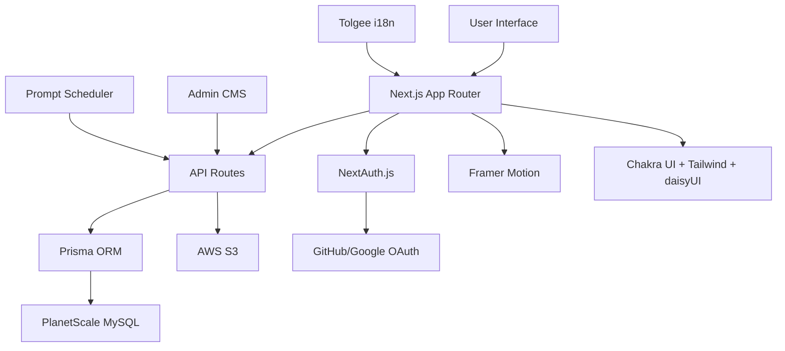
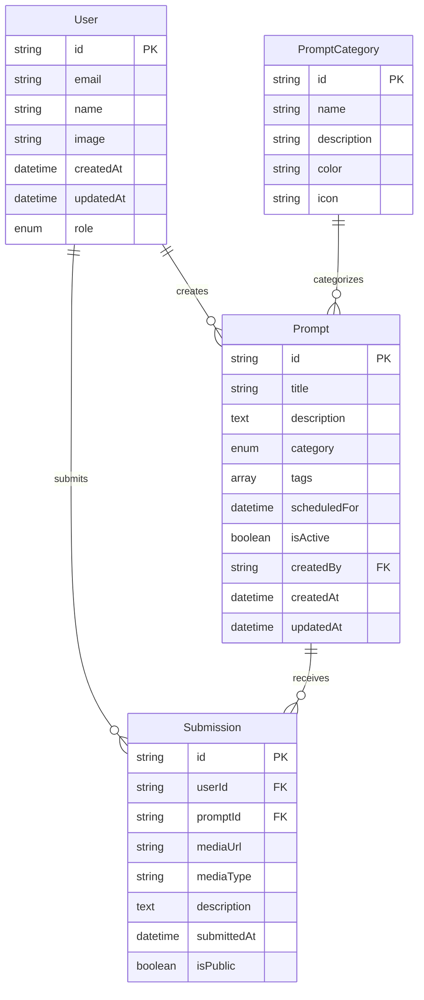

# 🏗️ Daily Prompt Wall - System Architecture

## Project Overview

Daily Prompt Wall is a creative, community-driven web app where users respond to a new artistic prompt every 24 hours. The platform supports mixed creative prompts (drawing, photography, writing, mixed media) with admin-managed content and UTC midnight reveals.

## Core System Architecture



## Tech Stack

| Layer | Technology | Purpose |
|-------|------------|---------|
| **Framework** | Next.js 15 (App Router) | React framework for SSR, routing, and API handling |
| **Styling** | Tailwind CSS + daisyUI + Chakra UI | Utility classes, UI components, accessibility |
| **Animation** | Framer Motion | Midnight prompt reveals and transitions |
| **Authentication** | NextAuth.js (GitHub + Google) | User sign-in and session management |
| **Database** | Prisma + PlanetScale (MySQL) | Type-safe DB access with horizontal scaling |
| **File Storage** | AWS S3 | Store images and videos from user submissions |
| **Internationalization** | Tolgee | Runtime translation and language switching |
| **Validation** | Yup | Client-side form validation |
| **Deployment** | Vercel | Hosting and CI/CD |

## Database Schema



## Key Features

### 🎯 Daily Prompt System
- **UTC Midnight Activation**: Global consistency across all users
- **Category Support**: Drawing, Photography, Writing, Mixed Media
- **Admin Management**: Content management system for prompt creation
- **Scheduling**: Pre-schedule prompts up to 365 days in advance
- **Rich Content**: Support for text, images, and multimedia prompts

### 🔐 Authentication & Authorization
- **OAuth Integration**: GitHub and Google sign-in
- **Role-Based Access**: User, Admin, Moderator roles
- **Session Management**: Secure session handling with NextAuth
- **Profile Management**: User profiles and preferences

### 📱 Responsive UI/UX
- **Mobile-First Design**: Optimized for all screen sizes
- **Accessibility**: WCAG compliant components
- **Dark/Light Mode**: Theme switching support
- **Smooth Animations**: Framer Motion for engaging interactions

### 🌍 Internationalization
- **Runtime Translation**: Tolgee for dynamic language switching
- **Multi-Language Support**: English, French, Spanish, etc.
- **Cultural Formatting**: Date, time, and number formatting
- **RTL Support**: Right-to-left language support

### ☁️ Media Management
- **AWS S3 Storage**: Secure and scalable file storage
- **Multi-Format Support**: Images (JPG, PNG, GIF), Videos (MP4, WebM)
- **File Validation**: Client and server-side validation
- **CDN Delivery**: Global content delivery for performance

## Directory Structure

```
src/
├── app/
│   ├── (auth)/
│   │   ├── login/
│   │   └── register/
│   ├── (dashboard)/
│   │   ├── admin/
│   │   ├── profile/
│   │   └── submissions/
│   ├── api/
│   │   ├── auth/
│   │   ├── prompts/
│   │   ├── submissions/
│   │   └── upload/
│   ├── globals.css
│   ├── layout.tsx
│   └── page.tsx
├── components/
│   ├── ui/
│   ├── forms/
│   ├── admin/
│   └── animations/
├── lib/
│   ├── auth.ts
│   ├── db.ts
│   ├── s3.ts
│   └── utils.ts
├── hooks/
├── types/
└── prisma/
    ├── schema.prisma
    └── migrations/
```

## Implementation Phases

### Phase 1: Foundation (Weeks 1-2)
- [ ] Set up project dependencies and configuration
- [ ] Design and implement database schema with Prisma
- [ ] Basic authentication setup with NextAuth
- [ ] UI foundation with Chakra UI + Tailwind integration

### Phase 2: Core Features (Weeks 3-4)
- [ ] Admin content management system for prompts
- [ ] Daily prompt scheduling and UTC midnight logic
- [ ] File upload system with AWS S3 integration
- [ ] Basic user interface for prompt display and submissions

### Phase 3: Advanced Features (Weeks 5-6)
- [ ] Prompt reveal system with Framer Motion animations
- [ ] Prompt history and archive functionality
- [ ] Real-time features for prompt reveals
- [ ] Internationalization with Tolgee

### Phase 4: Polish & Deploy (Week 7)
- [ ] Client-side validation with Yup
- [ ] Performance optimization
- [ ] Testing and bug fixes
- [ ] Deployment configuration for Vercel

## API Design

### Core Endpoints

```
GET    /api/prompts/current     - Get today's active prompt
GET    /api/prompts/history     - Get prompt history with pagination
POST   /api/prompts             - Create new prompt (admin only)
PUT    /api/prompts/[id]        - Update prompt (admin only)
DELETE /api/prompts/[id]        - Delete prompt (admin only)

GET    /api/submissions         - Get user submissions
POST   /api/submissions         - Submit response to prompt
PUT    /api/submissions/[id]    - Update submission
DELETE /api/submissions/[id]    - Delete submission

POST   /api/upload              - Upload media files to S3
GET    /api/upload/signed-url   - Get signed URL for direct upload

GET    /api/admin/stats         - Get admin dashboard statistics
GET    /api/admin/users         - Get user management data
```

## Security Considerations

- **Authentication**: Secure OAuth implementation with NextAuth
- **Authorization**: Role-based access control for admin features
- **File Upload**: Secure S3 uploads with signed URLs
- **Input Validation**: Client and server-side validation
- **Rate Limiting**: API rate limiting to prevent abuse
- **CORS**: Proper CORS configuration for API endpoints

## Performance Optimization

- **Image Optimization**: Next.js Image component with lazy loading
- **Caching**: Redis caching for frequently accessed data
- **CDN**: AWS CloudFront for global content delivery
- **Database**: Optimized queries with Prisma
- **Bundle Splitting**: Code splitting for optimal loading

## Monitoring & Analytics

- **Error Tracking**: Sentry for error monitoring
- **Performance**: Web Vitals tracking
- **User Analytics**: Privacy-focused analytics
- **Database Monitoring**: PlanetScale insights
- **Uptime Monitoring**: Service health checks